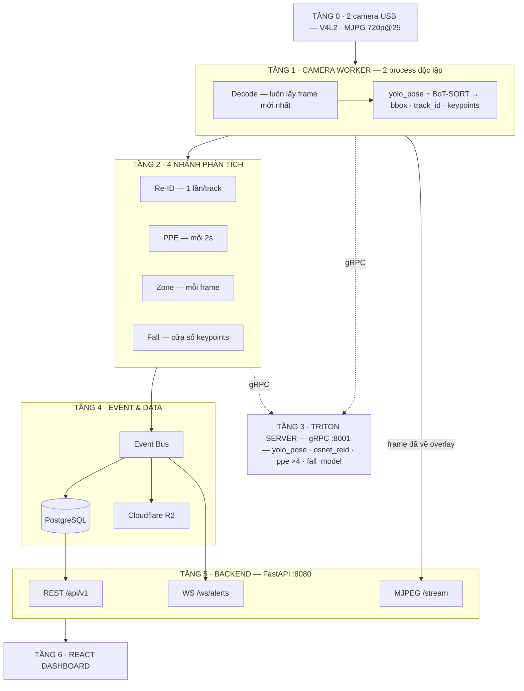
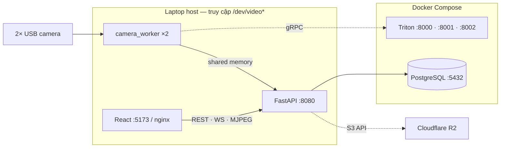
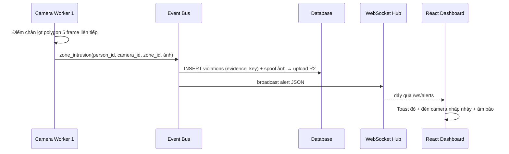

# Kiến Trúc Hệ Thống — Industrial Safety AI Analytics

> **v1.4 — tích hợp model fall thật (18/07/2026).** Bản đầy đủ có giải thích chi tiết: [artifact review](https://claude.ai/code/artifact/94ff4b14-4ef9-4a90-93a5-66fc753eed60)

Hệ thống giám sát an toàn nhà máy **2 camera USB** với 4 tính năng: **Re-ID · PPE · Restricted Zone · Fall Detection**, chạy trên laptop GPU **4GB VRAM**.

## 5 Quyết Định Kiến Trúc Đã Chốt

| # | Quyết định | Chi tiết |
|---|---|---|
| 1 | **Camera: USB** | V4L2, ép FOURCC `MJPG` 1280×720@25 — 2 luồng YUYV thô sẽ vượt băng thông USB |
| 2 | **Pose chạy trên Triton — YOLO11n-pose (v1.4)** | Đổi từ YOLOv8n để khớp phân bố keypoints mà model fall được train; `imgsz 640 · conf 0.25` khóa cứng; tracking dùng BoT-SORT (**BoxMOT**) trên detections |
| 3 | **Fall model nhận chuỗi keypoints** | Buffer trượt theo **timestamp**/track, resample 60 bước; cửa sổ ~1s, cần ≥8 điểm thật |
| 4 | **Lưu trữ tách đôi** | Ảnh/video bằng chứng → **Cloudflare R2** (S3 API); dữ liệu có cấu trúc → **PostgreSQL**; DB chỉ lưu `evidence_key` |
| 5 | **Tích hợp model fall thật (v1.4)** | Temporal Transformer (Keras → ONNX) input (60, 85); threshold retune **F2** + debounce M/N; heuristic làm lưới an toàn WARNING; **beta** tới khi qua field-test |

## Sơ Đồ Pipeline End-to-End

Nét liền = luồng dữ liệu chính (trên xuống) · Nét đứt = gọi inference sang Triton.



## Chi Tiết Từng Tầng

### Tầng 0 — Ingest (USB)
- OpenCV `VideoCapture` backend **V4L2**, mỗi camera 1 device index (`/dev/video0`, `/dev/video2`)
- **Bắt buộc** ép `FOURCC MJPG` + 1280×720: 2 luồng YUYV thô vượt băng thông USB (nguyên nhân số 1 khiến cam thứ hai không mở được). Nếu vẫn nghẽn → cắm 2 cổng thuộc 2 USB controller khác nhau
- Luôn đọc frame mới nhất (bỏ frame cũ khi chậm), tự mở lại khi camera bị rút/cắm

### Tầng 1 — Camera Worker (1 process/camera)
- `multiprocessing` — thoát GIL hoàn toàn; worker **không giữ model nào**
- Pose model: **YOLO11n-pose** (v1.4 — model fall được train trên keypoints của YOLO11n; dùng detector khác là lệch phân bố đầu vào). `imgsz 640 · conf 0.25` khóa theo cấu hình train
- Chuỗi xử lý: preprocess (letterbox 640) → gRPC `yolo_pose` → decode + NMS → **BoT-SORT (BoxMOT)** gán track_id; mỗi kết quả kèm **timestamp**
- BoxMOT chạy trên detections thuần, tắt Re-ID nội bộ của tracker (đã có nhánh Re-ID riêng)
- Track ID tiền tố theo camera (`cam1-17`); danh tính toàn cục do Re-ID quyết định
- **Không I/O mạng chặn trong vòng lặp frame** (DB, R2, email đều đi qua Event Bus)

### Tầng 2 — 4 Nhánh Phân Tích
| Nhánh | Tần suất | Cách hoạt động |
|---|---|---|
| **Re-ID** | 1 lần/track mới | Crop 128×256 → `osnet_reid` → vector 512-D → so cosine (threshold 0.3) với **gallery toàn cục cross-camera** |
| **PPE** | mỗi 2s/người | Crop đầu/mặt/thân/tay từ keypoints → 4 classifier 128×128 → cooldown 30s chống ghi trùng |
| **Zone** | mỗi frame (CPU) | Điểm chân (đáy bbox) → `cv2.pointPolygonTest` với polygon từ DB → debounce 5 frame ([zone.py](../ai_engine/analytics/zone.py)) |
| **Fall** | cửa sổ ~1s, stride ~0.3s | Pipeline 4 khối ([fall.py](../ai_engine/analytics/fall.py)): TrackKeypointBuffer (timestamp, ≥8 điểm) → FallPreprocessor (normalize + nội suy + resample 60 + velocity ⇒ 60×85) → fall_model Triton → FallDecision (F2 threshold + debounce M/N) ⇒ CRITICAL; heuristic W/H + góc thân là lưới an toàn WARNING |

### Tầng 3 — Triton Inference Server & Ngân Sách VRAM

Triton 24.01 (Docker), ONNX Runtime backend, gRPC :8001, dynamic batching gộp request 2 camera.

| Thành phần | Precision | VRAM ước tính | Ghi chú |
|---|---|---|---|
| CUDA context + Triton runtime | — | ~500 MB | Cố định |
| yolo_pose (1 instance chung 2 cam) | FP16 | ~400–600 MB | Dynamic batch |
| osnet_reid | FP16 | ~250 MB | max_batch 16 |
| ppe ×4 (head/face/hand/torso) | FP16 | ~400 MB | Classifier nhỏ |
| fall_model (Temporal Transformer) | FP32 | ~50–100 MB | Weights chỉ 2.8MB — chủ yếu là runtime |
| **Tổng** | | **~1.6–1.9 GB / 4 GB** | Headroom ~2 GB |

Quy tắc: mọi model `instance_count: 1`, xuất ONNX FP16. Lưu ý VRAM thực tế < 4GB nếu GPU rời kiêm xuất màn hình — kiểm tra `nvidia-smi`.

### Tầng 4 — Event & Data (Chi tiết: [LAYER_4_IMPLEMENTATION.md](LAYER_4_IMPLEMENTATION.md))
- Mọi nhánh chỉ **phát sự kiện** → 1 consumer duy nhất ghi DB + đẩy ảnh vào hàng đợi upload
- **Uploader R2 bất đồng bộ**: spool ra đĩa (`evidence_spool/`) → worker upload retry / local static fallback ([storage.py](../backend/storage.py))
- **PostgreSQL 16** (Local service / Container): tự động khởi tạo 6 ORM Models (`users`, `cameras`, `violations`, `zones`, `persons`, `system_events`)

### Tầng 5 — Backend API (FastAPI :8080)
- **REST** `/api/v1/`: cameras, zones, violations (ảnh = presigned URL R2 hết hạn 1h), persons, reports, auth (JWT), settings (ngưỡng runtime, bật/tắt model per-camera), alerts/emergency
- **WebSocket** `/ws/alerts`: fan-out cảnh báo real-time ([ws.py](../backend/ws.py))
- **MJPEG** `/stream/{camera_id}`: frame đã vẽ overlay ([streaming.py](../backend/streaming.py)); nâng cấp WebRTC (MediaMTX) chỉ khi cần <200ms

### Tầng 6 — React Dashboard (frontend/) — "VisionGuard AI"
React 19 + Vite 8 + Router 7, theme sáng/tối. Đã có: Dashboard (metrics + live + recent violations), Cameras (grid, add/delete/power, AI overlay toggle, modal telemetry + model checkbox), Violations (bảng + lọc + snapshot), Reports (KPI + biểu đồ + xuất CSV/PDF), Settings (email digest, SMS, auto-record, retention), Emergency Alert, Login/Register.

**Còn thiếu:** zone editor vẽ polygon, loại vi phạm Fall, trang quản lý nhân viên (gallery Re-ID), route `/models` chưa đăng ký, biểu đồ Reports chưa render cột (bug CSS).

## Nhánh Fall — Model Thật (v1.4)

Model bàn giao: **Compact Temporal Transformer** (Conv1D + 2 encoder, d_model 96, weights 2.8MB), train trên Multiple Cameras Fall Dataset, nguồn keypoints **YOLO11n-pose**. Nguồn: `notebookb0cb845271.ipynb`.

**Metrics test:** ROC-AUC 0.84 · PR-AUC 0.85 · precision 0.93 · **recall 0.45 @0.525 (⚠ bỏ sót 55% cú ngã — phải retune F2)**.

| Thành phần | Vai trò |
|---|---|
| `TrackKeypointBuffer` | Ring buffer theo timestamp/track (~1.2s); chỉ predict khi ≥8 điểm thật trong cửa sổ 1s |
| `FallPreprocessor` | Tái hiện đúng notebook: normalize tâm hông/scale thân → NaN + nội suy thời gian → resample 60 bước → + velocity ⇒ `(60, 85)`. Load `weights/fall_model/inference_config.json` — không hardcode |
| `fall_model` trên Triton | Keras → ONNX (tf2onnx), verify diff < 1e-4 trên 50 mẫu so với Keras trước khi deploy |
| `FallDecision` | Threshold F2 (runtime-tunable) + debounce M/N + cooldown/track ⇒ `fall_detected` CRITICAL |

**Cổng kiểm định hiện trường:** quay 10–20 cú ngã giả lập đúng góc camera/ánh sáng thật; recall sau F2 + debounce ≥ 0.8 mới gỡ nhãn beta. Ràng buộc hệ quả: pose inference giữ ≥ ~15 FPS để cửa sổ đủ dày.

## Serving & Bottleneck — Đã Chốt (17/07/2026)

Bottleneck gRPC nội bộ **không nằm ở mạng** mà ở **serialize + copy bộ nhớ**: tensor pose FP32 640×640 = 4.9MB/frame → 2 cam @25fps là ~245MB/s bị copy 3–4 lần (tốn CPU). Re-ID/PPE payload nhỏ, gọi thưa — gRPC thuần là đủ.

| # | Quyết định | Chi tiết |
|---|---|---|
| 1 | **Latest-frame + 1 in-flight** | Buffer camera 1 phần tử (ghi đè); mỗi worker tối đa 1 request pose đang chờ → không bao giờ backlog |
| 2 | **Dynamic batching batch 2** | `max_batch_size 2 · preferred [2] · queue_delay 2000µs · instance 1` — tune bằng perf_analyzer (0/1/2/5ms) |
| 3 | **Không sync tick 2 worker** | Chỉ đặt cùng FPS mục tiêu; xem lại khi tỷ lệ batch-2 thấp (metrics :8002) VÀ GPU là bottleneck |
| 4 | **Fall theo timestamp** | Resample về FPS model được train, không dùng số frame cứng |
| 5 | **Ưu tiên bằng tần suất tự nhiên** | Re-ID 1 lần · PPE 2s · fall theo window; chưa dùng priority_levels (chỉ tác dụng trong queue 1 model) |
| 6 | **Ladder tối ưu** | uint8 + normalize trong ONNX graph (**làm ngay từ export script**) → ONNX FP16 + batch 2 → TensorRT FP16 (build .plan trên máy đích, verify accuracy) → giảm size/FPS. Song song: Triton System Shared Memory cho đường pose khi số đo yêu cầu (mount chung `/dev/shm` với container) |

Config `yolo_pose` đã chốt:

```protobuf
max_batch_size: 2

dynamic_batching {
  preferred_batch_size: [ 2 ]
  max_queue_delay_microseconds: 2000
}

instance_group [ { count: 1, kind: KIND_GPU } ]
```

**Giao thức đo (không tối ưu chay):** perf_analyzer quét queue delay → p95/p99; Triton metrics :8002 (tỷ lệ batch, queue time, GPU util); telemetry per-stage trong worker (decode/preprocess/gRPC/tracking/encode) hiển thị lên dashboard; **test sustained 1–2 giờ** vì laptop throttle nhiệt.

## Ngân Sách Độ Trễ Real-time

| Chặng | Độ trễ ước tính |
|---|---|
| Capture USB 720p@25 | 40 ms/frame |
| Preprocess | ~2–4 ms |
| yolo_pose Triton (gRPC, gồm queue delay) | ~10–25 ms |
| BoT-SORT | ~3–8 ms |
| Zone + overlay + JPEG encode | ~5–10 ms |
| MJPEG tới browser (LAN) | ~100–300 ms |
| **Glass-to-glass (video)** | **~200–400 ms** |
| **Phát hiện → toast (WebSocket)** | **< 150 ms** |

Nguyên tắc: latest-frame-only + 1 in-flight; không I/O chặn trong vòng lặp frame; nhánh chậm bất đồng bộ; đo liên tục.

## Topology Hạ Tầng



- Worker + backend chạy **host** (cần `/dev/video*` + shared memory frame); Triton + Postgres trong **Docker**
- Triton: NVIDIA runtime, `shm_size 2GB`, healthcheck `/v2/health/ready`, `restart: unless-stopped`
- Secrets qua `.env` (R2, DB, SMTP/SMS) — đã ignore
- Thứ tự khởi động: compose up → healthcheck → backend → workers → frontend; worker tự retry gRPC

## Dịch Vụ Phụ Trợ (rút ra từ UI)

| Tính năng trên UI | Dịch vụ nền | Công nghệ |
|---|---|---|
| Email báo cáo hằng ngày 18:00 | Job tổng hợp + gửi mail | APScheduler + SMTP |
| SMS khẩn cấp khi Danger | Notification hook trên Event Bus | Twilio / eSMS API |
| Auto Record 10s trước/sau | Ring buffer frame → clip ~20s → R2 | deque + OpenCV VideoWriter |
| Retention (số ngày lưu snapshot) | Job dọn evidence quá hạn | Cron + R2 lifecycle + DELETE DB |
| Nút Emergency Alert | `POST /api/v1/alerts/emergency` → broadcast | FastAPI + WS hub + SMS |
| Bật/tắt model per-camera + telemetry | Runtime Settings API + kênh telemetry | REST + WS, không cần restart |

## Chuỗi Sự Kiện Một Cảnh Báo Vùng Cấm



## Cấu Trúc Monorepo

```text
├── ai_engine/                  # Pipeline AI
│   ├── workers/tracker.py      # (chuyển dần thành camera_worker.py per-camera)
│   ├── analytics/
│   │   ├── reid_pipeline.py    # Luồng định danh OSNet
│   │   ├── ppe_pipeline.py     # Luồng kiểm tra PPE + cooldown
│   │   ├── ppe_detection.py    # 4 classifier client (Triton gRPC)
│   │   ├── crop_body.py        # Cắt bộ phận từ keypoints
│   │   ├── zone.py             # Vùng cấm: point-in-polygon + debounce
│   │   └── fall.py             # Pipeline 4 khối: buffer → preprocess → Triton → decision
│   └── inference/reid_client.py # OSNet Triton gRPC client
├── backend/                    # FastAPI (skeleton)
│   ├── main.py                 # App + /health
│   ├── api/                    # Routers (sẽ xây)
│   ├── ws.py                   # WebSocket hub
│   ├── streaming.py            # MJPEG generator
│   ├── storage.py              # R2 client (boto3, presigned URL)
│   └── models/                 # SQLAlchemy + Pydantic (sẽ xây)
├── frontend/                   # React 19 — VisionGuard AI dashboard
├── triton_model_repo/          # yolo_pose · osnet_reid · ppe ×4 (+ fall_model/)
├── database/                   # SQLite hiện tại → PostgreSQL + Alembic
├── export_scripts/             # Export .pt → .onnx (thêm uint8 + normalize in-graph)
├── docs/ARCHITECTURE.md        # Tài liệu này
├── config.py                   # Cấu hình (sẽ chuyển dần sang config.yaml)
├── main.py                     # Entry hiện tại (sẽ thay bằng per-camera worker)
└── docker-compose.yml          # triton (+ postgres, backend, frontend sẽ thêm)
```

## Lộ Trình Chuyển Đổi

1. ✅ Re-ID + PPE lên Triton (nhánh `feature/triton-inference-server`)
2. ✅ Chốt kiến trúc + serving + tái cấu trúc thư mục (nhánh `feature/system-redesign`)
3. ⬜ Export **YOLO11n-pose** uint8-in-graph lên Triton + BoxMOT, chuyển 3-thread → per-camera worker
4. ⬜ Zone intrusion end-to-end (DB zones → checker → event)
5. ⬜ PostgreSQL + R2 + Event Bus
6. ⬜ Backend API (REST + WS + MJPEG) → nối frontend
7. 🔄 Fall model: ✅ có weights + fall.py 4 khối → ⬜ convert ONNX → ⬜ retune F2 (Kaggle) → ⬜ field-test gate → chạy thật 2 camera USB + benchmark sustained

## Repo & Tài Liệu Tham Khảo

- [PPE-Safety-Compliance-Detection-System](https://github.com/The-Harsh-Vardhan/PPE-Safety-Compliance-Detection-System) — stack FastAPI + React + PostgreSQL gần nhất
- [PPE-Detection-and-Danger-Zone-Monitoring-System](https://github.com/HugoLi0213/PPE-Detection-and-Danger-Zone-Monitoring-System) — danger zone polygon
- [triton-server-yolo](https://github.com/levipereira/triton-server-yolo) / [triton-client-yolo](https://github.com/levipereira/triton-client-yolo) — YOLO trên Triton chuẩn
- [BoxMOT](https://github.com/mikel-brostrom/boxmot) — BoT-SORT độc lập model
- [yolov8-pose-fall-detection](https://github.com/zhahoi/yolov8-pose-fall-detection) · [Human-Fall-Detection](https://github.com/Tomotsugu-dev/Human-Fall-Detection) — fall từ keypoints
- [Triton Batchers](https://docs.nvidia.com/deeplearning/triton-inference-server/user-guide/docs/user_guide/batcher.html) · [Triton Optimization + perf_analyzer](https://docs.nvidia.com/deeplearning/triton-inference-server/user-guide/docs/user_guide/optimization.html) — tài liệu tune dynamic batching
- [Ultralytics + Triton guide](https://docs.ultralytics.com/guides/triton-inference-server) — export & TensorRT
- [Savant](https://github.com/insight-platform/Savant) — tham khảo kiến trúc (không dùng, overkill cho 2 cam)
