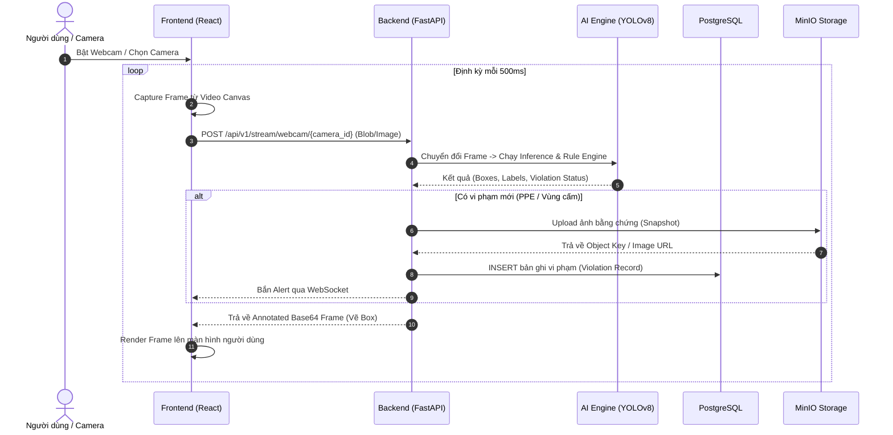

# 🦺 TỔNG QUAN VÀ KIẾN TRÚC TỔNG THỂ HỆ THỐNG
## Construction Safety AI — Hệ thống Giám sát An toàn Công trường Thời gian thực

---

## 1. Giới thiệu tổng quan

**Construction Safety AI** là hệ thống thông minh ứng dụng Thị giác máy tính (Computer Vision) và Học sâu (Deep Learning) nhằm tự động giám sát an toàn lao động tại các công trường xây dựng theo thời gian thực. Hệ thống hỗ trợ phát hiện vi phạm trang bị bảo hộ (PPE), cảnh báo xâm nhập khu vực nguy hiểm, phát hiện tai nạn té ngã và tự động lưu trữ bằng chứng phục vụ công tác quản trị, báo cáo.

### Mục tiêu cốt lõi:
* **Giám sát tự động 24/7:** Thay thế việc kiểm tra thủ công, giảm thiểu rủi ro tai nạn.
* **Thời gian thực (Real-time):** Độ trễ thấp từ lúc camera bắt hình đến khi phát hiện và cảnh báo.
* **Lưu trữ bằng chứng minh bạch:** Lưu snapshot hình ảnh vi phạm lên Object Storage (MinIO) và ghi vết cơ sở dữ liệu (PostgreSQL).

---

## 2. Tính năng chính của hệ thống

| Nhóm chức năng | Mô tả chi tiết |
| :--- | :--- |
| **🪖 Phát hiện vi phạm PPE** | Nhận diện người lao động có hoặc không trang bị: Mũ bảo hộ (`Hardhat` / `NO-Hardhat`), Áo phản quang (`Vest` / `NO-Vest`). |
| **🚧 Cảnh báo vùng nguy hiểm** | Cho phép vẽ đa giác vùng cấm (Danger Zone) trên giao diện; cảnh báo tức thì khi người lao động di chuyển vào vùng này. |
| **🫸 Phát hiện ngã (Fall Detection)** | Phân tích tư thế và tỷ lệ bounding box để kích hoạt cảnh báo khẩn cấp khi xảy ra sự cố ngã. |
| **📹 Quản lý đa nguồn Video** | Hỗ trợ Laptop Webcam (qua Web MediaStream API), IP Camera công trường (RTSP) và File tải lên (MP4/Ảnh). |
| **🔔 Thông báo thời gian thực** | Bắn cảnh báo qua WebSocket về Dashboard ngay khi phát hiện vi phạm. |
| **📊 Dashboard & Analytics** | Thống kê số lượng vi phạm theo thời gian, biểu đồ phân bố lỗi và nhật ký chi tiết kèm ảnh bằng chứng. |

---

## 3. Kiến trúc tổng thể hệ thống (System Architecture)

Hệ thống được thiết kế theo kiến trúc phân tầng dạng Microservices-ready, tối ưu cho xử lý stream tốc độ cao và khả năng mở rộng.

```mermaid
flowchart TB
    %% ================= STYLES =================
    classDef clientStyle fill:#e0f2fe,stroke:#0284c7,stroke-width:2px,color:#0369a1
    classDef gatewayStyle fill:#fef3c7,stroke:#d97706,stroke-width:2px,color:#92400e
    classDef aiStyle fill:#ffedd5,stroke:#ea580c,stroke-width:2px,color:#9a3412
    classDef storageStyle fill:#f3e8ff,stroke:#9333ea,stroke-width:2px,color:#6b21a8
    classDef inputStyle fill:#ecfdf5,stroke:#059669,stroke-width:2px,color:#065f46

    %% ================= INPUT LAYER =================
    subgraph INPUTS[" 📹 TẦNG NGUỒN DỮ LIỆU (Data Ingestion) "]
        webcam["💻 Laptop / USB Webcam<br/>(MediaStream API)"]
        rtsp["🎥 Camera Công trường<br/>(RTSP Stream)"]
        files["📁 File Uploads<br/>(MP4, AVI, JPG)"]
    end
    class webcam,rtsp,files inputStyle

    %% ================= CLIENT LAYER =================
    subgraph FRONTEND[" 🖥️ TẦNG GIAO DIỆN (Client Layer — React 18 + Vite) "]
        direction TB
        ui_dashboard["📊 Dashboard & Thống kê"]
        ui_stream["🔴 Live Stream & Overlay Bounding Box"]
        ui_zones["🚧 Zone Manager (Vẽ đa giác vùng cấm)"]
        ui_violations["📋 Lịch sử & Chi tiết vi phạm"]
        webcam_ctx["🔄 WebcamContext<br/>(Capture nền 500ms / 2 FPS)"]
        ws_client["⚡ WebSocket Client"]
    end
    class FRONTEND clientStyle

    %% ================= BACKEND LAYER =================
    subgraph BACKEND[" ⚙️ TẦNG MÁY CHỦ (Backend Layer — FastAPI + Uvicorn) "]
        direction TB
        api_gateway["🔀 API Router & Auth Middleware"]
        
        subgraph ENDPOINTS["API Endpoints (/api/v1)"]
            ep_stream["/stream/webcam & /stream/ws"]
            ep_cameras["/cameras"]
            ep_violations["/violations"]
            ep_zones["/zones"]
            ep_detect["/detect"]
        end
        
        grpc_svc["🔌 gRPC Service (High-throughput RPC)"]
    end
    class BACKEND gatewayStyle

    %% ================= AI INFERENCE LAYER =================
    subgraph AI_CORE[" 🧠 TẦNG TRÍ TUỆ NHÂN TẠO (AI Inference & Rules) "]
        direction TB
        yolo["🎯 YOLOv8 Detection Engine<br/>(Classes: Person, Hardhat, NO-Hardhat, Vest, NO-Vest)"]
        rule_engine{"📐 Rule Engine Phân tích"}
        ppe_check["🪖 PPE Validator"]
        zone_check["🛑 Polygon Intersection Check"]
        fall_check["🫸 Fall & Posture Detection"]
        cooldown_filter["⏱️ Anti-spam / Cooldown Buffer"]
    end
    class AI_CORE aiStyle

    %% ================= STORAGE LAYER =================
    subgraph STORAGE[" 💾 TẦNG LƯU TRỮ (Data & Object Storage) "]
        direction TB
        postgres[("🐘 PostgreSQL 16<br/>- Users / Auth<br/>- Cameras & Zone Geometries<br/>- Violation Logs")]
        minio[("🪣 MinIO Object Storage (S3 API)<br/>- Ảnh chụp bằng chứng vi phạm<br/>- Evidence Snapshots")]
    end
    class STORAGE storageStyle

    %% ================= CONNECTIONS =================
    webcam -->|MediaStream / Canvas Frame| webcam_ctx
    rtsp -->|RTSP Ingestion| ep_stream
    files -->|Multipart POST| ep_detect

    webcam_ctx -->|POST Frame Blob (500ms)| ep_stream
    ws_client <==>|Real-time Events| ep_stream

    ui_dashboard & ui_zones & ui_violations -->|HTTP REST| api_gateway
    api_gateway --> ENDPOINTS

    ep_stream & ep_detect --> yolo
    yolo --> rule_engine
    rule_engine --> ppe_check & zone_check & fall_check
    ppe_check & zone_check & fall_check --> cooldown_filter

    cooldown_filter -->|Ghi log sự cố| postgres
    cooldown_filter -->|Lưu ảnh snapshot| minio
    cooldown_filter -->|Bắn cảnh báo + Frame Base64| ep_stream
    ep_stream -->|Annotated Frame| webcam_ctx
    ep_stream -->|Broadcast Alert| ws_client

    ep_cameras & ep_zones & ep_violations -->|CRUD Queries| postgres
    ep_violations -->|Lấy ảnh bằng chứng| minio
```

---

### 3.2 Bảng Sơ đồ Kiến trúc Tổng thể (Architecture Matrix Table)

Bảng dưới đây trực quan hóa toàn bộ các tầng trong hệ thống, bao gồm thành phần, công nghệ, dữ liệu đầu vào/đầu ra và giao thức kết nối:

| Tầng (Layer) | Thành phần (Component) | Công nghệ / Thư viện | Dữ liệu Đầu vào (Input) | Dữ liệu Đầu ra (Output) | Giao thức / Cổng | Nhiệm vụ chính |
| :--- | :--- | :--- | :--- | :--- | :--- | :--- |
| **1. Data Ingestion** | • Laptop / USB Webcam<br/>• Camera RTSP<br/>• File Uploads | • HTML5 MediaStream<br/>• OpenCV VideoCapture<br/>• Multipart Form | Luồng video quang học từ cảm biến / file nén | Raw Video Frames (RGB / BGR Array) | • In-browser Canvas<br/>• RTSP (Port 554)<br/>• HTTP POST (Port 8000) | Thu thập tín hiệu hình ảnh từ thực địa công trường |
| **2. Client (SPA)** | • Dashboard & Analytics<br/>• Live Feed & Canvas Overlay<br/>• Zone Drawer<br/>• WebcamContext | • React 18<br/>• TypeScript<br/>• Vite<br/>• CSS Modules | • User clicks / configs<br/>• Webcam stream<br/>• Server Alert Events | • Frame Blob (gửi định kỳ 500ms)<br/>• Tọa độ đa giác Zone (JSON)<br/>• UI hiển thị thời gian thực | • HTTP / REST<br/>• WebSocket Client<br/>• Port 5173 | Giao diện điều khiển, hiển thị trực quan cảnh báo, vẽ vùng cấm và quản lý camera |
| **3. Backend & API** | • API Router & Endpoints<br/>• WebSocket Manager<br/>• Stream Handler<br/>• gRPC Server | • Python 3.10+<br/>• FastAPI<br/>• Uvicorn<br/>• gRPC Python | • HTTP Requests<br/>• Video Frames (Blob / Image)<br/>• Metadata vi phạm từ AI | • JSON API responses<br/>• Base64 Annotated Image<br/>• WebSocket broadcast messages | • HTTP / REST (Port 8000)<br/>• WS (`/ws/alerts`)<br/>• gRPC (Port 50051) | Điều phối trung tâm, xác thực quyền truy cập, định tuyến dữ liệu, điều phối AI và lưu trữ |
| **4. AI Core & Rules** | • YOLOv8 Detector<br/>• PPE Association Module<br/>• Zone Intrusion (Shapely)<br/>• Fall Posture Detector<br/>• Debounce Buffer | • PyTorch<br/>• Ultralytics YOLOv8<br/>• OpenCV<br/>• Shapely (Polygon) | Raw Image Frames (NumPy Array) + Cấu hình Zone từ DB | • Bounding Boxes & Confidence<br/>• Danh sách vi phạm (Violations list)<br/>• Annotated Frame (vẽ box) | Inter-process / In-memory Function Call | Phân tích thị giác máy tính: phát hiện người, trang bị bảo hộ, kiểm tra xâm nhập vùng cấm và té ngã |
| **5. Storage Layer** | • PostgreSQL Database<br/>• MinIO Object Storage | • PostgreSQL 16 Alpine<br/>• MinIO (S3 Compatible)<br/>• SQLAlchemy ORM | • User / Camera / Zone data<br/>• Violation metadata (JSONB)<br/>• Ảnh chụp sự cố (JPG/PNG) | • Truy vấn SQL báo cáo<br/>• Presigned Image URL bằng chứng | • PostgreSQL (Port 5432)<br/>• MinIO S3 API (Port 9002)<br/>• MinIO UI (Port 9001) | Lưu trữ an toàn, toàn vẹn dữ liệu cấu trúc và tệp tin đa phương tiện dung lượng lớn |

---

### 3.3 Bảng Ma trận Luồng Dữ liệu (Dataflow Matrix)

| Bước | Bên gửi (Source) | Bên nhận (Destination) | Dữ liệu truyền tải (Payload) | Giao thức (Protocol) | Tần suất / Độ trễ | Mục đích |
| :---: | :--- | :--- | :--- | :--- | :--- | :--- |
| **1** | Laptop Webcam | Frontend `WebcamContext` | MediaStream Track (Video Element) | Trình duyệt DOM API | Realtime (~30 FPS) | Thu nhận hình ảnh trực tiếp từ webcam |
| **2** | Frontend | FastAPI Backend | Image Blob (JPEG encoded) | `POST /stream/webcam/{cam_id}` | 2 FPS (Mỗi 500ms) | Đẩy frame lên server để AI phân tích |
| **3** | FastAPI Backend | YOLOv8 + Rule Engine | NumPy Array Frame (H x W x C) | Memory Pointer / In-process | ~30ms - 60ms / frame | Suy luận đối tượng và kiểm tra quy tắc an toàn |
| **4** | Rule Engine | MinIO Storage | Image Buffer (Ảnh chụp vi phạm) | AWS S3 SDK (PutObject) | Bất đồng bộ khi có lỗi | Lưu trữ file ảnh bằng chứng vi phạm |
| **5** | Rule Engine | PostgreSQL | SQL Insert: Time, CameraID, Type, Coords | SQLAlchemy (TCP: 5432) | Bất đồng bộ khi có lỗi | Ghi nhận nhật ký sự cố phục vụ tra cứu & báo cáo |
| **6** | FastAPI Backend | Frontend | JSON (Alert info) + Base64 (Ảnh đã vẽ box) | HTTP Response & WebSocket | < 100ms response | Hiển thị frame đã vẽ box + Bắn chuông cảnh báo |

---

## 4. Chi tiết các tầng thành phần

### 4.1 Tầng Client (Frontend)
* **Công nghệ:** React 18, TypeScript, Vite, CSS Modules, Material Symbols.
* **Cơ chế hoạt động chính:**
  * **[WebcamContext](file:///d:/Construction-safety-ai/frontend/src/contexts/WebcamContext.tsx):** Quản lý luồng webcam toàn cục, vẽ canvas ẩn để capture frame mỗi 500ms và gửi về backend. Luồng webcam tiếp tục chạy xuyên suốt khi người dùng chuyển trang.
  * **Interactive Zone Canvas:** Cho phép người dùng trực tiếp vẽ các đỉnh của vùng cấm (Polygon) đè lên hình ảnh camera.
  * **Theme System:** Hỗ trợ linh hoạt chế độ sáng (*Precision Lens*) và tối (*Glacier Glass*).

### 4.2 Tầng Máy chủ (Backend)
* **Công nghệ:** Python 3.10+, FastAPI, Uvicorn, SQLAlchemy ORM, Pydantic v2.
* **Chức năng:**
  * Tiếp nhận frame ảnh từ client, giải mã dạng numpy array cho mô hình AI.
  * Cung cấp RESTful API đầy đủ cho xác thực (JWT Auth), quản lý camera, vùng nguy hiểm, lịch sử vi phạm.
  * Đóng vai trò WebSocket Server để đẩy thông báo thời gian thực khi có vi phạm mới.
  * Tích hợp gRPC Server phục vụ giao tiếp hiệu năng cao giữa các microservices.

### 4.3 Tầng AI Inference & Rule Engine
* **Công nghệ:** YOLOv8 (Ultralytics), PyTorch, OpenCV, Shapely.
* **Mô hình & Pipeline xử lý:**
  1. **Object Detection:** Nhận diện 5 nhãn đối tượng: `Person`, `Hardhat`, `NO-Hardhat`, `Vest`, `NO-Vest`.
  2. **PPE Association:** Gán nhãn bảo hộ vào từng đối tượng công nhân tương ứng dựa trên IoU / vị trí bounding box.
  3. **Spatial Analysis (Vùng cấm):** Tính toán tọa độ chân/tâm của đối tượng so với đa giác vùng cấm bằng thuật toán *Point-in-Polygon*.
  4. **Cooldown / Debounce:** Cơ chế lọc chống spam giúp tránh việc 1 vi phạm bị lưu hàng trăm lần trong vài giây.

### 4.4 Tầng Lưu trữ (Storage)
* **PostgreSQL 16:**
  * Lưu trữ dữ liệu có cấu trúc: Tài khoản, danh mục Camera, tọa độ vùng nguy hiểm (JSONB/Geometry), bản ghi vi phạm (thời gian, loại lỗi, độ tin cậy).
* **MinIO Object Storage:**
  * Tương thích chuẩn AWS S3.
  * Chuyên dụng lưu trữ hình ảnh snapshot bằng chứng vi phạm dung lượng lớn, giúp tối ưu hiệu năng và kích thước của Database.

---

## 5. Luồng dữ liệu chi tiết (End-to-End Sequence Flow)



---

## 6. Cấu trúc thư mục dự án

```
Construction-safety-ai/
├── ai/                             # Mã nguồn huấn luyện & model weights (YOLO)
│   └── model_ppe.pt
├── backend/                        # Máy chủ FastAPI
│   ├── app/
│   │   ├── ai/                     # Pipeline suy luận AI & Rule engine
│   │   ├── api/v1/endpoints/       # REST API (cameras, violations, zones, stream...)
│   │   ├── models/                 # SQLAlchemy ORM Models
│   │   ├── schemas/                # Pydantic Schemas
│   │   ├── services/               # Logic nghiệp vụ & MinIO client
│   │   └── main.py                 # Khởi chạy FastAPI App
│   ├── Dockerfile
│   └── requirements.txt
├── frontend/                       # Giao diện React + TypeScript
│   ├── src/
│   │   ├── components/             # Reusable UI components
│   │   ├── contexts/               # React Context (WebcamContext, AuthContext...)
│   │   ├── layouts/                # Layout (MainLayout, Sidebar, Header)
│   │   ├── pages/                  # Dashboard, Cameras, Violations, Zones, Settings
│   │   └── services/               # Axios API client & WebSocket helper
│   ├── package.json
│   └── vite.config.ts
├── docs/                           # Tài liệu kỹ thuật & Kiến trúc hệ thống
│   ├── he_thong.md                 # Tài liệu tổng quan & Kiến trúc này
│   └── webcam_integration_report.md
├── docker-compose.yml              # Cấu hình triển khai (PostgreSQL, MinIO, Backend)
└── README.MD                       # Hướng dẫn chung
```

---

## 7. Hướng dẫn khởi chạy hệ thống

### Bước 1: Khởi động Hạ tầng & Backend bằng Docker
```bash
docker-compose up -d --build
```
* **FastAPI Backend:** `http://localhost:8000` (Tài liệu Swagger: `http://localhost:8000/docs`)
* **MinIO Console:** `http://localhost:9001` (User/Pass: `minioadmin` / `minioadmin`)
* **PostgreSQL:** Port `5432`

### Bước 2: Khởi động Giao diện Frontend
```bash
cd frontend
npm install
npm run dev
```
* **Frontend Web Dashboard:** `http://localhost:5173`
