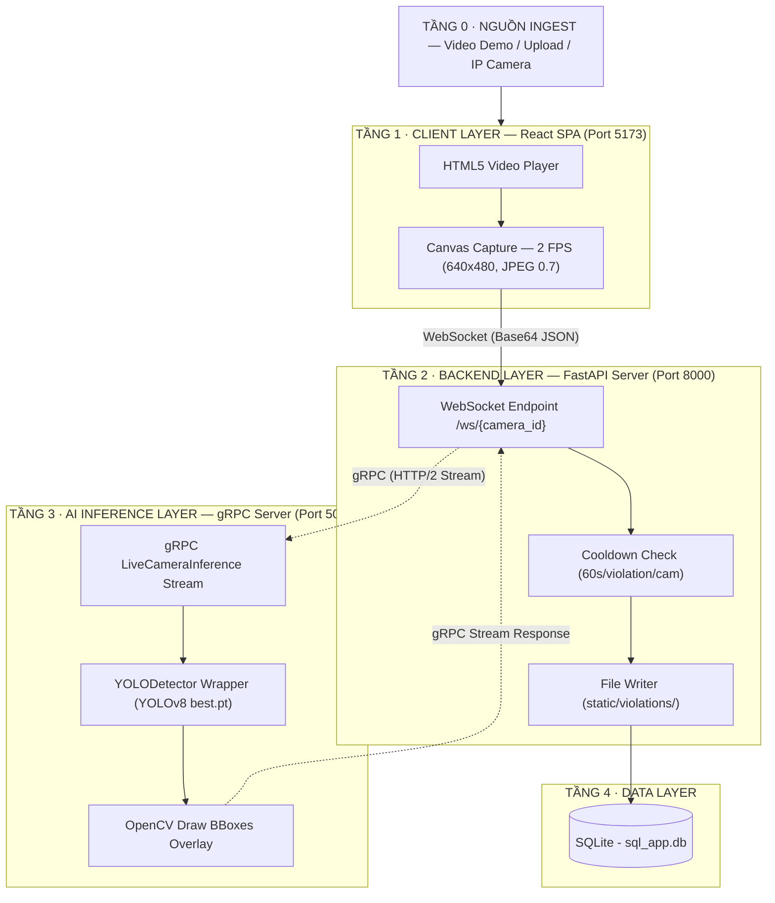
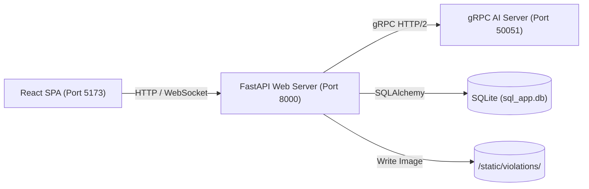
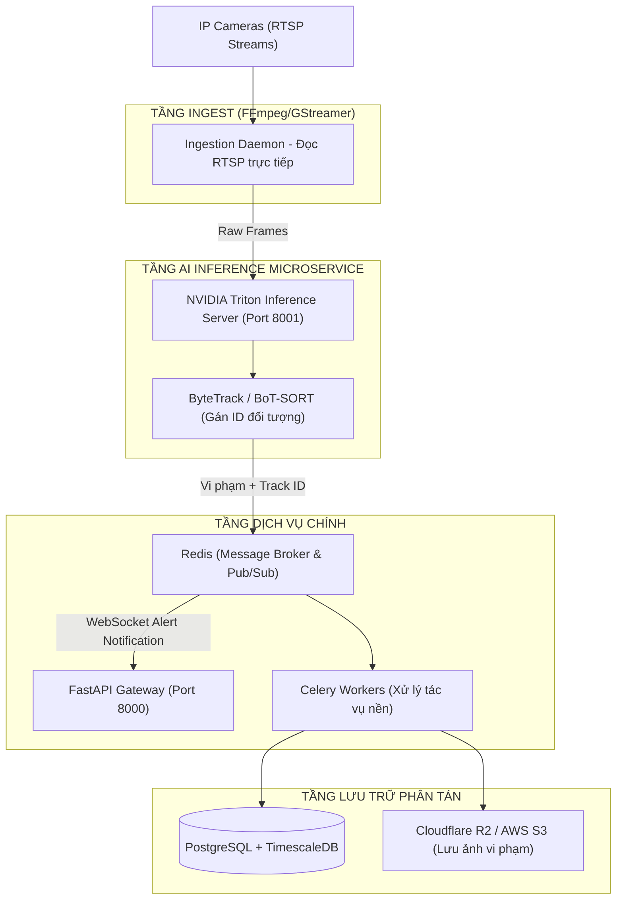

# Kiến Trúc Hệ Thống — Construction Safety AI

> **v1.0 — tích hợp gRPC + WebSocket Bridge (31/07/2026).** Bản tài liệu tổng hợp thiết kế V1 của hệ thống giám sát an toàn công trường thời gian thực.

Hệ thống giám sát an toàn công trường xây dựng phân tích luồng video **theo thời gian thực** với 3 nhóm tính năng: **Phát hiện thiếu đồ bảo hộ (PPE) · Xâm nhập vùng cấm · Phát hiện té ngã**, chạy trên môi trường lai (Hybrid) gồm React Frontend, FastAPI Backend và gRPC AI Inference Engine.

---

## 5 Quyết Định Kiến Trúc Đã Chốt (V1)

| # | Quyết định | Chi tiết |
|---|---|---|
| 1 | **Truyền tải video: WebSocket Base64** | Trình duyệt Client giải mã video, capture frame bằng canvas ở độ phân giải **640x480 (JPEG, 0.7 quality)** và gửi chuỗi Base64 qua WebSocket mỗi **500ms (2 FPS)**. |
| 2 | **Cầu nối trung gian: WS-gRPC Bridge** | FastAPI Backend đóng vai trò Bridge: nhận Base64 từ WebSocket, giải mã thành bytes thô và đẩy vào luồng stream gRPC để giảm tải xử lý logic mạng cho AI Server. |
| 3 | **Xử lý AI: gRPC Bidirectional Stream** | Tách phần xử lý AI thành gRPC Server độc lập (`port 50051`) chạy luồng stream hai chiều (`LiveCameraInference`). Nhận frame, chạy YOLOv8, vẽ overlay đè lên ảnh và stream trả lại bytes ảnh đã vẽ. |
| 4 | **Lưu trữ dữ liệu: Tách đôi** | Ảnh bằng chứng vi phạm dạng vật lý lưu tại thư mục tĩnh `/static/violations/` cục bộ; logs và trạng thái vi phạm lưu trữ trong cơ sở dữ liệu quan hệ **SQLite** (`sql_app.db`). |
| 5 | **Cơ chế lọc nhiễu: Cooldown 60 giây** | Áp dụng thời gian chờ (cooldown) **60 giây** cho mỗi loại vi phạm trên mỗi camera. Tránh spam ghi trùng lặp một lỗi liên tục vào DB khi đối tượng đứng yên. |

---

## Sơ Đồ Pipeline End-to-End

Nét liền = luồng dữ liệu chính · Nét đứt = gọi inference / gRPC streaming.



---

## Chi Tiết Từng Tầng

### Tầng 0 — Nguồn Ingest (Video)
- Sử dụng video demo ghi hình công trường sẵn có trong thư mục `video_demo/` hoặc tệp tin do người dùng tải lên trực tiếp.
- Phục vụ qua static mount của FastAPI tại `/static/videos/` để client tải và hiển thị trên thẻ `<video>`.

### Tầng 1 — Client Layer (React)
- File cốt lõi: [CameraCard.tsx](file:///d:/Construction-safety-ai/frontend/src/pages/Cameras/CameraCard.tsx).
- Trình duyệt đóng vai trò "Ingest Node":
  - Sử dụng `canvas.getContext('2d')` chụp frame từ thẻ `<video>` ẩn.
  - Cưỡng bức kích thước ảnh về **640x480** để dung lượng ảnh Base64 luôn `< 100KB`, loại bỏ nguy cơ crash WebSocket do quá giới hạn payload (1MB).
  - Tần suất chụp gửi cố định qua `setInterval` là **500ms** (tương đương 2 FPS).
  - Lắng nghe CustomEvent `violation-detected` để kích hoạt thông báo Toast cảnh báo tức thời lên màn hình điều khiển.

### Tầng 2 — Backend Layer (FastAPI Bridge)
- File cốt lõi: [stream.py](file:///d:/Construction-safety-ai/backend/app/api/v1/endpoints/stream.py).
- Kết nối WebSocket `/api/v1/stream/ws/{camera_id}` hoạt động như một Proxy/Bridge:
  - Nhận text JSON chứa ảnh Base64 từ Frontend.
  - Giải mã Base64 -> raw bytes, bọc vào đối tượng Proto `FrameRequest`.
  - Đẩy vào hàng đợi `asyncio.Queue` để stream sang gRPC Server.
  - Nhận lại luồng `StreamFrameResponse` chứa ảnh đã vẽ bounding box.
  - Nếu phát hiện vi phạm (`total_violations > 0`): Kiểm tra bộ nhớ tạm `last_violation_times`. Nếu khoảng cách giữa hai lần vi phạm cùng loại > 60 giây, tiến hành ghi file ảnh vật lý vào `/static/violations/{violation_id}.jpg` và gọi [violation_service.py](file:///d:/Construction-safety-ai/backend/app/services/violation_service.py) để lưu bản ghi vào DB với trạng thái `PENDING`.
  - Chuyển đổi ảnh vẽ đè sang Base64 và phản hồi lại client.

### Tầng 3 — AI Inference Layer (gRPC Server)
- File cốt lõi: [grpc_server.py](file:///d:/Construction-safety-ai/backend/grpc_server.py).
- Định nghĩa qua file proto: [camera_stream.proto](file:///d:/Construction-safety-ai/backend/app/proto/camera_stream.proto).
- Nhận byte ảnh đầu vào -> Giải mã bằng OpenCV (`cv2.imdecode`) -> Chuyển thành BGR numpy array.
- Gọi [detector.py](file:///d:/Construction-safety-ai/backend/ai/detector.py) (lớp `YOLODetector` bọc mô hình YOLOv8):
  - Model chạy ở chế độ Single-frame inference. Sử dụng khóa lock đa luồng `threading.Lock` để đồng bộ truy cập mô hình.
  - Nhãn nhận diện: `helmet`, `no_helmet`, `vest`, `no_vest`, `person`, `zone_intrusion`, `fall`.
  - Mặc định sử dụng mock-detection nếu không tìm thấy tệp trọng số `best.pt`.
- OpenCV vẽ bounding box (Đỏ = Vi phạm, Xanh = An toàn) trực tiếp lên ảnh nguồn và encode lại thành JPEG bytes chuyển trả về backend.

### Tầng 4 — Data Layer (SQLite)
- Thiết lập ORM qua SQLAlchemy tại [database.py](file:///d:/Construction-safety-ai/backend/app/core/database.py).
- Cấu trúc 3 thực thể chính:
  - `UserModel` (bảng `users`): Phân quyền quản trị hệ thống (`ADMIN`, `SUPER_ADMIN`).
  - `CameraModel` (bảng `cameras`): Danh sách camera, địa chỉ IP và mô tả vị trí lắp đặt.
  - `ViolationModel` (bảng `violations`): Lưu trữ sự cố an toàn, khóa ngoại liên kết tới camera và user duyệt lỗi.
- Check Constraint đặc biệt: Ràng buộc tính nhất quán kiểm duyệt (`chk_review_consistency`): Nếu vi phạm đang ở trạng thái `PENDING`, các trường thông tin kiểm duyệt `reviewed_by` và `reviewed_at` bắt buộc phải bằng `NULL`.

---

## Phân Tích Serving & Bottleneck (V1)

Kiến trúc V1 sử dụng WebSocket kết hợp gRPC có ưu điểm là tách biệt được tiến trình AI nặng nề khỏi tiến trình xử lý web chính. Tuy nhiên, hiệu năng bị giới hạn bởi các điểm nghẽn (bottleneck) sau:

```
[Client Canvas Capture] ──(1. Base64 encode)──> [FastAPI WebSocket] ──(2. Base64 decode)──> [gRPC Client] ──(3. Network copy)──> [gRPC Server] ──(4. Model Lock + CPU/GPU Inference)
```

1. **Serialization Overhead (Nghẽn tại 1 & 2):** Việc mã hóa ảnh sang Base64 trên Frontend rồi giải mã ngược lại trên FastAPI làm phình dung lượng truyền tải thêm 33% và tiêu tốn tài nguyên CPU của cả Client và Web Server một cách vô ích.
2. **Model GIL & Lock Threading (Nghẽn tại 4):** Việc bọc YOLOv8 bằng Python threading và sử dụng `threading.Lock()` khiến AI Engine chỉ có thể xử lý tuần tự (Single Threaded Inference). Khi số lượng camera kết nối đồng thời tăng lên, các yêu cầu sẽ bị hàng đợi tích lũy gây trễ (latency).
3. **Database Write Blocking (Nghẽn ghi DB):** Cơ sở dữ liệu SQLite thực hiện khóa toàn bộ tệp tin khi có hành động ghi (Write Lock). Khi nhiều camera cùng lúc phát hiện lỗi và lưu ảnh/ghi bản ghi vi phạm, hệ thống có thể phát sinh lỗi `sqlite3.OperationalError: database is locked`.

---

## Ngân Sách Độ Trễ Real-time (V1)

Do xử lý Base64 và đồng bộ mô hình bằng lock, tổng độ trễ được ước lượng trong điều kiện chạy local như sau:

| Chặng | Độ trễ ước tính | Tính chất |
|---|---|---|
| Capture canvas & nén JPEG tại Client | ~5–10 ms | Tốn CPU Client |
| Truyền tải WebSocket (Base64) | ~15–30 ms | Phụ thuộc tốc độ mạng |
| Giải mã Base64 tại FastAPI | ~3–5 ms | Tốn CPU FastAPI |
| Truyền tải gRPC (HTTP/2 Stream) | ~2–4 ms | Rất nhanh (Localhost) |
| Giải mã ảnh & tiền xử lý tại gRPC Server | ~5–8 ms | OpenCV decode |
| YOLOv8 Inference (Chạy CPU) | ~150–250 ms | **Bottleneck chính (Nếu dùng CPU)** |
| YOLOv8 Inference (Chạy GPU CUDA) | ~15–30 ms | Rất mượt |
| Vẽ bounding box & mã hóa ngược JPEG | ~4–8 ms | OpenCV encode |
| Lưu DB & ghi đĩa ảnh vi phạm | ~10–25 ms | IO chặn (Blocking IO) |
| **Glass-to-glass (Độ trễ hiển thị luồng)** | **~250–350 ms (GPU) / ~400–600 ms (CPU)** | Đạt yêu cầu thời gian thực cơ bản |

---

## Topology Hạ Tầng (V1)



- **Môi trường hoạt động:** Chạy trên cùng một máy chủ vật lý (Localhost).
- **FastAPI Port 8000:** Đầu mối giao tiếp duy nhất của client.
- **gRPC Port 50051:** Chạy dưới dạng background service, không lộ ra ngoài internet để đảm bảo an toàn bảo mật cho AI Engine.

---

## Đánh Giá Nhận Xét & Điểm Yếu Kiến Trúc V1

1. **Ngốn tài nguyên Client:** Trình duyệt phải liên tục giải mã luồng video và chạy vòng lặp capture ảnh -> gửi WebSocket. Trình duyệt chạy lâu sẽ bị nóng máy, tốn RAM và tiêu hao pin lớn (đối với thiết bị di động).
2. **Thiếu cơ chế tự phục hồi (Fault Tolerance):** Nếu gRPC Server bị sập, kết nối WebSocket của Client cũng bị đứt hoàn toàn. Không có hàng đợi tin nhắn (Message Queue) để lưu tạm thời các ảnh vi phạm khi DB bận.
3. **Giới hạn số lượng Camera:** Do YOLOv8 được gọi tuần tự thông qua Lock, hệ thống V1 khó có thể duy trì mức FPS ổn định khi số lượng camera vượt quá **3 luồng**.
4. **Không có Object Tracking:** Phát hiện vi phạm thuần túy trên từng frame đơn lẻ. Nếu một người không đội mũ bảo hiểm đứng yên, cứ sau 60 giây (cooldown) hệ thống lại tạo thêm 1 bản ghi cảnh báo mới, gây rác dữ liệu DB.

---

## Kế Hoạch Cải Tiến & Nâng Cấp (Lên V2)

### Sơ đồ đề xuất kiến trúc phân tán V2


### Các bước nâng cấp cụ thể:
1. **Thay đổi luồng Ingestion:** Trình duyệt client không tham gia gửi ảnh. Backend hoặc camera worker chạy daemon FFmpeg kết nối thẳng RTSP của camera, trích xuất frame đưa trực tiếp vào pipeline AI xử lý.
2. **Triển khai Triton Inference Server:** Thay thế gRPC server tự viết bằng NVIDIA Triton Server. Cấu hình ONNX FP16 kèm Dynamic Batching để tối ưu hóa tài nguyên phần cứng GPU và phục vụ đồng thời hàng chục camera.
3. **Tích hợp Object Tracking:** Áp dụng ByteTrack để theo dõi công nhân theo thời gian thực. Mỗi người vi phạm chỉ bắn cảnh báo **1 lần duy nhất** cho đến khi biến mất khỏi khung hình hoặc thay đổi trạng thái, giải quyết triệt để vấn đề spam cảnh báo.
4. **Bảo mật và Xác thực:** Đăng ký middleware JWT trên kết nối WebSocket để xác thực người dùng trước khi cấp quyền nhận stream cảnh báo hoặc cấu hình camera.
5. **Cơ chế Hàng đợi & TimescaleDB:** Dùng Redis/RabbitMQ để nhận sự kiện vi phạm bất đồng bộ. Thay SQLite bằng PostgreSQL + TimescaleDB để lưu trữ logs sự kiện lớn mà không gây khóa bảng ghi dữ liệu.
