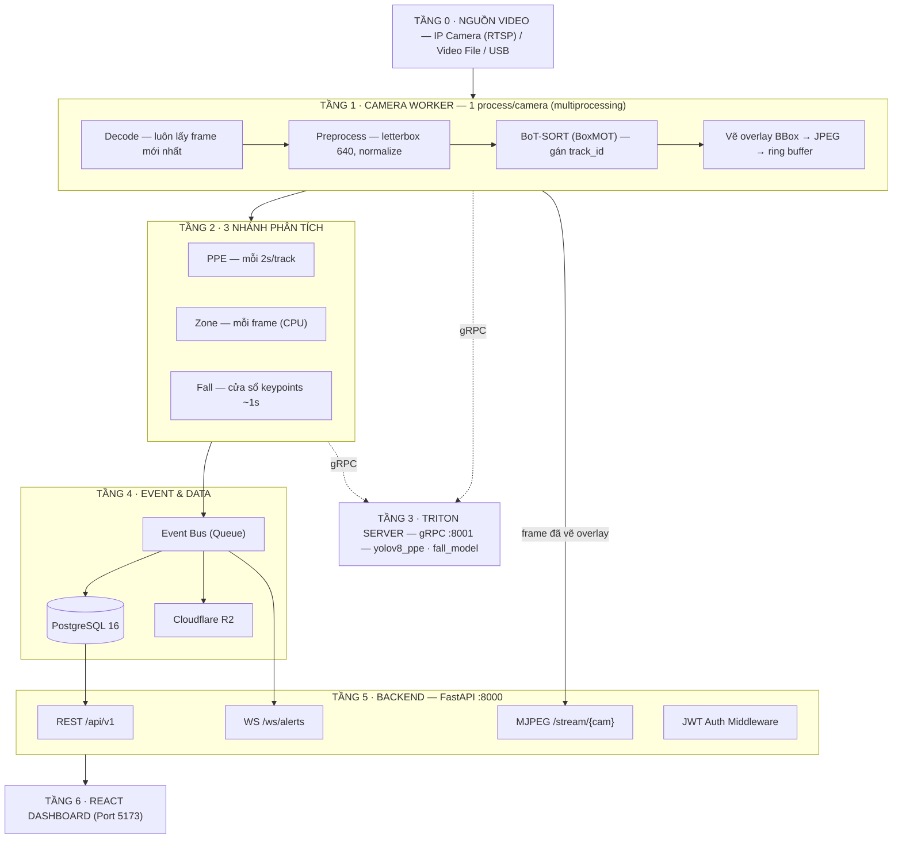
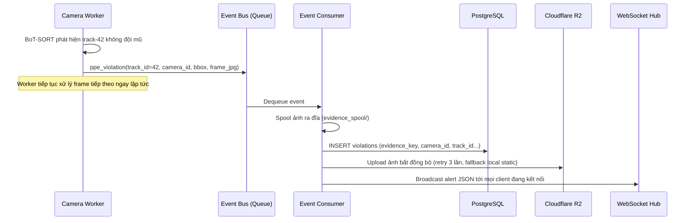
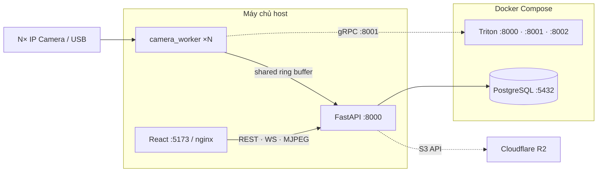
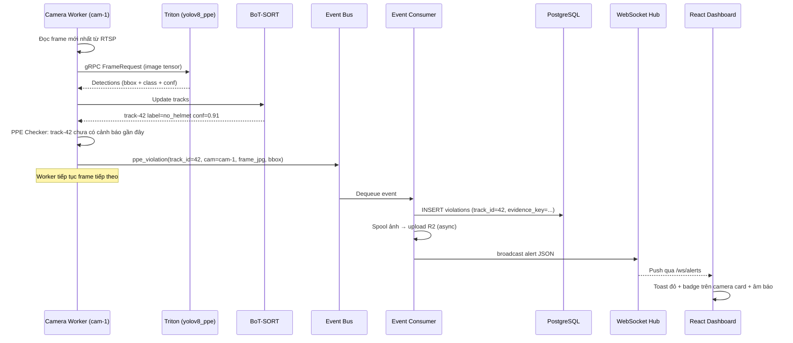

# Kiến Trúc Hệ Thống — Construction Safety AI (V2 Đề Xuất)

> **v2.0-proposal — thiết kế nâng cấp (31/07/2026).** Dựa trên phân tích bottleneck V1 hiện tại và tham khảo kiến trúc [ARCHITECTURE.md](file:///d:/Construction-safety-ai/ARCHITECTURE.md) (Industrial Safety AI Analytics — hệ thống giám sát 2 camera USB, Triton, BoT-SORT, PostgreSQL, R2).

Hệ thống giám sát an toàn công trường xây dựng **N camera IP** với 3 nhóm tính năng: **PPE Detection · Zone Intrusion · Fall Detection**, chạy trên máy chủ có GPU (khuyến nghị ≥ 6GB VRAM) kết hợp Docker Compose.

---

## So Sánh V1 → V2: Những Gì Thay Đổi & Tại Sao

| # | V1 hiện tại | V2 đề xuất | Lý do |
|---|---|---|---|
| 1 | Client capture canvas → Base64 → WebSocket | **Server-side Ingest**: Camera Worker đọc RTSP/video trực tiếp, client chỉ xem MJPEG | Loại bỏ 33% overhead Base64 + tải nặng CPU trình duyệt; client mỏng hơn, chạy được trên điện thoại |
| 2 | gRPC Server tự viết + `threading.Lock` tuần tự | **Triton Inference Server** (Docker, ONNX, dynamic batching) | Triton gộp batch tự động, quản lý hàng đợi/GPU instance chuyên nghiệp; scale nhiều camera không cần viết code |
| 3 | Single-frame detection, cooldown 60s | **BoT-SORT (BoxMOT)** gán Track ID + cooldown per-track | Mỗi người chỉ bắn cảnh báo 1 lần duy nhất; loại bỏ spam; cooldown tự nhiên theo track lifecycle |
| 4 | SQLite (`database is locked` khi ghi đồng thời) | **PostgreSQL 16** (Docker container, concurrent writes) | PostgreSQL row-level locking, không bao giờ lock toàn file; sẵn sàng cho mở rộng |
| 5 | Ảnh vi phạm lưu thư mục tĩnh `static/violations/` | **Cloudflare R2** (S3 API) + local spool fallback | Phân tán lưu trữ; presigned URL hết hạn; không lo ổ đĩa đầy; backup tự động |
| 6 | Ghi DB trực tiếp trong vòng lặp stream (blocking) | **Event Bus** → consumer duy nhất ghi DB + upload R2 bất đồng bộ | Không I/O chặn trong pipeline frame; fault-tolerant: queue giữ event khi DB tạm chết |
| 7 | Không có xác thực WebSocket | **JWT Auth** trên mọi endpoint (REST + WS + MJPEG) | Ngăn truy cập trái phép vào stream camera và dữ liệu vi phạm |

---

## 7 Quyết Định Kiến Trúc V2

| # | Quyết định | Chi tiết |
|---|---|---|
| 1 | **Ingest: Server-side** | Camera Worker (`multiprocessing`, 1 process/camera) đọc RTSP hoặc video file bằng OpenCV; client không tham gia capture. Luôn đọc frame mới nhất (bỏ cũ khi chậm) |
| 2 | **Detection: YOLOv8 trên Triton** | Export `best.pt` → ONNX FP16; Triton gRPC `:8001`; `max_batch_size` theo số camera; `instance_count: 1` (1 GPU) |
| 3 | **Tracking: BoT-SORT (BoxMOT)** | Chạy trên detections trong Camera Worker; Track ID tiền tố camera (`cam1-17`); cooldown/track thay vì cooldown/type |
| 4 | **Lưu trữ tách đôi** | Ảnh bằng chứng → **Cloudflare R2** (spool đĩa + retry); dữ liệu có cấu trúc → **PostgreSQL 16**; DB chỉ lưu `evidence_key` |
| 5 | **Event Bus nội bộ** | `asyncio.Queue` hoặc `multiprocessing.Queue`; mọi nhánh phân tích chỉ phát sự kiện → 1 consumer ghi DB + đẩy upload + broadcast WS |
| 6 | **Hiển thị: MJPEG** | Camera Worker vẽ overlay (bbox + nhãn) lên frame → encode JPEG → đẩy vào ring buffer → FastAPI phục vụ tại `/stream/{camera_id}`. Nâng cấp WebRTC khi cần <200ms |
| 7 | **Auth: JWT** | `POST /api/v1/auth/login` → access token (15 phút) + refresh token; middleware validate trên REST, WS handshake query param, MJPEG bearer |

---

## Sơ Đồ Pipeline End-to-End (V2)

Nét liền = luồng dữ liệu chính · Nét đứt = gọi inference sang Triton.



---

## Chi Tiết Từng Tầng

### Tầng 0 — Ingest (Video Source)

**V1:** Client decode video → canvas capture → Base64 → WebSocket → FastAPI → gRPC. Client làm Ingest Node.

**V2:** Server làm Ingest Node. Camera Worker đọc trực tiếp từ nguồn video.

| Nguồn | Cách đọc | Ghi chú |
|---|---|---|
| IP Camera (RTSP) | `cv2.VideoCapture("rtsp://...")` + backend CAP_FFMPEG | Ưu tiên cho production; hỗ trợ H.264/H.265 |
| Video file demo | `cv2.VideoCapture("path/to/file.mp4")` + loop | Giữ lại cho dev/demo, tương thích V1 |
| USB Camera | `cv2.VideoCapture(0)` + backend V4L2 (Linux) hoặc DSHOW (Windows) | Ép MJPG codec, 1280×720 |

Quy tắc: luôn đọc frame mới nhất (buffer 1 phần tử, ghi đè frame cũ). Camera Worker tự mở lại khi nguồn bị ngắt.

```python
# Pseudocode Camera Reader — latest-frame-only
class LatestFrameReader:
    def __init__(self, source):
        self.cap = cv2.VideoCapture(source)
        self._frame = None
        self._lock = threading.Lock()
        # Thread riêng liên tục đọc frame mới nhất
        threading.Thread(target=self._reader_loop, daemon=True).start()

    def _reader_loop(self):
        while True:
            ret, frame = self.cap.read()
            if ret:
                with self._lock:
                    self._frame = frame  # Ghi đè frame cũ

    def read(self):
        with self._lock:
            return self._frame.copy() if self._frame is not None else None
```

### Tầng 1 — Camera Worker (1 process/camera)

**Thay đổi cốt lõi so với V1:**
- `multiprocessing.Process` thay vì chạy inference trong thread FastAPI → **thoát GIL hoàn toàn**
- Worker **không giữ model nào** trong bộ nhớ → gọi Triton qua gRPC
- **Không I/O mạng chặn** trong vòng lặp frame (DB, R2, email đều đi qua Event Bus)

Chuỗi xử lý trong mỗi vòng lặp frame:

```
Read frame → Preprocess (letterbox 640) → gRPC yolov8_ppe (Triton) → Decode detections
    → BoT-SORT gán track_id → Phân tích (PPE/Zone/Fall) → Phát event → Vẽ overlay → Push ring buffer
```

**File cần tạo mới:**
- `backend/workers/camera_worker.py` — 1 process xử lý toàn bộ pipeline cho 1 camera
- `backend/workers/worker_manager.py` — spawn/kill/restart workers theo danh sách camera trong DB

**File tái sử dụng từ V1:**
- [image_utils.py](file:///d:/Construction-safety-ai/backend/app/utils/image_utils.py) — `bytes_to_numpy`, `numpy_to_bytes` giữ nguyên
- [constants.py](file:///d:/Construction-safety-ai/backend/app/core/constants.py) — `VIOLATION_LABELS` giữ nguyên, bổ sung mapping track event

### Tầng 2 — 3 Nhánh Phân Tích

Áp dụng mô hình nhánh phân tích từ ARCHITECTURE.md tham khảo, điều chỉnh cho bài toán hiện tại (không có Re-ID ở V2 ban đầu):

| Nhánh | Tần suất | Cách hoạt động | Khác V1 |
|---|---|---|---|
| **PPE** | mỗi 2s/track | Detection kết quả từ YOLOv8 đã bao gồm nhãn `no_helmet`, `no_vest` → lọc theo track_id → cooldown **30s per track** chống ghi trùng | V1: cooldown 60s per violation_type per camera (quá thô) |
| **Zone** | mỗi frame (CPU thuần) | Điểm chân (đáy bbox) → `cv2.pointPolygonTest` với polygon từ DB → debounce **5 frame liên tiếp** mới phát event | V1: chưa có (chỉ là nhãn trong model, chưa vẽ polygon) |
| **Fall** | cửa sổ ~1s keypoints | Buffer trượt keypoints theo timestamp/track → khi đủ ≥8 điểm trong 1s → gọi fall classifier → debounce M/N | V1: chỉ là nhãn trong model, chưa có temporal pipeline |

**File cần tạo mới:**
- `backend/analytics/ppe_checker.py` — lọc detection → cooldown per track
- `backend/analytics/zone_checker.py` — point-in-polygon + debounce
- `backend/analytics/fall_pipeline.py` — buffer keypoints → classifier (giai đoạn sau)

### Tầng 3 — Triton Inference Server & Ngân Sách VRAM

**V1:** gRPC Server tự viết ([grpc_server.py](file:///d:/Construction-safety-ai/backend/grpc_server.py)) + `threading.Lock` → single-threaded inference.

**V2:** Triton 24.xx (Docker), ONNX Runtime backend, gRPC `:8001`, dynamic batching gộp request N camera.

#### Export Model

```bash
# Export YOLOv8 best.pt → ONNX FP16
yolo export model=ppe_5classes_model_results/weights/best.pt format=onnx half=True imgsz=640 simplify=True
```

#### Cấu trúc Triton Model Repository

```text
triton_model_repo/
├── yolov8_ppe/
│   ├── config.pbtxt
│   └── 1/
│       └── model.onnx        # Export từ best.pt
└── fall_classifier/           # Giai đoạn sau
    ├── config.pbtxt
    └── 1/
        └── model.onnx
```

#### Config Triton cho yolov8_ppe

```protobuf
name: "yolov8_ppe"
platform: "onnxruntime_onnx"
max_batch_size: 4

dynamic_batching {
  preferred_batch_size: [ 2, 4 ]
  max_queue_delay_microseconds: 5000
}

instance_group [ { count: 1, kind: KIND_GPU } ]
```

#### Ngân Sách VRAM Ước Tính

| Thành phần | Precision | VRAM ước tính | Ghi chú |
|---|---|---|---|
| CUDA context + Triton runtime | — | ~500 MB | Cố định |
| yolov8_ppe (5 classes, 1 instance) | FP16 | ~300–500 MB | Dynamic batch lên đến 4 |
| fall_classifier (giai đoạn sau) | FP32 | ~50–100 MB | Model nhỏ |
| **Tổng** | | **~0.9–1.1 GB** | Phù hợp GPU ≥ 4GB |

Quy tắc: mọi model `instance_count: 1`, xuất ONNX FP16. Nếu GPU yếu → fallback CPU (`KIND_CPU`).

### Tầng 4 — Event & Data

**V1:** Luồng stream [stream.py](file:///d:/Construction-safety-ai/backend/app/api/v1/endpoints/stream.py) ghi DB trực tiếp bên trong vòng lặp WebSocket → blocking I/O.

**V2:** Mọi nhánh phân tích chỉ **phát sự kiện** → 1 consumer duy nhất ghi DB + đẩy ảnh vào hàng đợi upload.



**Database — PostgreSQL 16:**

Giữ nguyên 3 model ORM từ V1 ([user.py](file:///d:/Construction-safety-ai/backend/app/models/user.py), [camera.py](file:///d:/Construction-safety-ai/backend/app/models/camera.py), [violation.py](file:///d:/Construction-safety-ai/backend/app/models/violation.py)), bổ sung thêm:

| Model mới | Vai trò |
|---|---|
| `ZoneModel` (bảng `zones`) | Lưu polygon vùng cấm per camera (list điểm JSON + tên + mức nghiêm trọng) |
| `SystemEventModel` (bảng `system_events`) | Log sự kiện hệ thống (camera online/offline, worker crash, model reload) |

Thay đổi trong `ViolationModel`:
- Thêm cột `track_id` (varchar, nullable) — Track ID từ BoT-SORT
- Thêm cột `evidence_key` (varchar) — Key trên R2 thay cho `image_path` local
- Đổi `image_path` thành nullable fallback (khi R2 upload thất bại, dùng local)

**Migration:** Sử dụng Alembic (đã có trong `requirements.txt`) để migrate từ SQLite → PostgreSQL.

**Uploader R2 bất đồng bộ:**

```python
# Pseudocode — evidence upload worker
class EvidenceUploader:
    SPOOL_DIR = Path("evidence_spool/")

    async def upload_with_retry(self, evidence_key: str, image_bytes: bytes):
        # 1. Spool ra đĩa trước (đảm bảo không mất)
        spool_path = self.SPOOL_DIR / f"{evidence_key}.jpg"
        spool_path.write_bytes(image_bytes)

        # 2. Upload lên R2 với retry
        for attempt in range(3):
            try:
                await self.r2_client.put_object(Key=evidence_key, Body=image_bytes)
                spool_path.unlink()  # Xóa spool sau khi upload thành công
                return
            except Exception:
                await asyncio.sleep(2 ** attempt)

        # 3. Fallback: giữ file local, phục vụ qua static
        logger.warning(f"R2 upload failed after 3 attempts: {evidence_key}")
```

### Tầng 5 — Backend API (FastAPI :8000)

**File tái sử dụng từ V1 (giữ nguyên hoặc mở rộng):**
- [router.py](file:///d:/Construction-safety-ai/backend/app/api/v1/router.py) — thêm route zones, auth, stream
- [violations.py](file:///d:/Construction-safety-ai/backend/app/api/v1/endpoints/violations.py) — giữ nguyên CRUD, ảnh trả về presigned URL R2
- [cameras.py](file:///d:/Construction-safety-ai/backend/app/api/v1/endpoints/cameras.py) — thêm endpoint bật/tắt AI per camera
- [violation_service.py](file:///d:/Construction-safety-ai/backend/app/services/violation_service.py) — giữ nguyên logic

**File thay đổi lớn:**
- [stream.py](file:///d:/Construction-safety-ai/backend/app/api/v1/endpoints/stream.py) — **xóa bỏ** logic WebSocket gRPC Bridge. Thay bằng:
  - `GET /stream/{camera_id}` — MJPEG (đọc từ ring buffer Camera Worker)
  - `WS /ws/alerts` — chỉ fan-out cảnh báo real-time (không còn gửi/nhận frame)

**Endpoint mới:**

| Method | Endpoint | Mô tả |
|---|---|---|
| `POST` | `/api/v1/auth/login` | Đăng nhập, trả JWT access + refresh token |
| `POST` | `/api/v1/auth/refresh` | Làm mới access token |
| `GET` | `/api/v1/zones` | Danh sách vùng cấm |
| `POST` | `/api/v1/zones` | Tạo vùng cấm (polygon JSON + camera_id) |
| `PUT` | `/api/v1/zones/{id}` | Cập nhật polygon |
| `GET` | `/stream/{camera_id}` | MJPEG stream (frame đã vẽ overlay) |
| `WS` | `/ws/alerts` | Fan-out cảnh báo real-time |
| `PUT` | `/api/v1/cameras/{id}/settings` | Bật/tắt model AI per camera, điều chỉnh ngưỡng confidence |

### Tầng 6 — React Dashboard

**Thay đổi chính trên Frontend:**
- **Xóa bỏ**: Logic canvas capture + WebSocket send frame trong [CameraCard.tsx](file:///d:/Construction-safety-ai/frontend/src/pages/Cameras/CameraCard.tsx). Component này hiện là bottleneck lớn nhất của V1.
- **Thay bằng**: Thẻ `` trỏ tới endpoint MJPEG `/stream/{camera_id}`. Browser tự decode MJPEG stream mà không cần JavaScript xử lý.

```tsx
// V2 CameraCard — client mỏng, không capture frame
function CameraCard({ camera }) {
  const streamUrl = `${API_BASE}/stream/${camera.id}`;

  return (
    <div className="camera-card">
      {/* MJPEG stream — browser tự decode, không cần canvas */}
      

      {/* Cảnh báo nhận qua WebSocket /ws/alerts — không gắn vào stream */}
      <ViolationBadge cameraId={camera.id} />
    </div>
  );
}
```

**Tính năng mới trên UI:**
- Zone Editor: vẽ polygon vùng cấm trên canvas overlay phía trên MJPEG stream
- Telemetry Panel: hiển thị FPS/inference time/GPU util per camera (data từ worker metrics)
- Settings per camera: bật/tắt từng loại detection (PPE, Zone, Fall)

---

## Ngân Sách Độ Trễ Real-time (V2)

| Chặng | Độ trễ ước tính | So với V1 |
|---|---|---|
| Capture RTSP/USB | ~40 ms/frame | Tương đương |
| Preprocess (letterbox 640 + normalize) | ~2–4 ms | Tương đương |
| YOLOv8 Triton gRPC (bao gồm queue delay) | ~10–25 ms (GPU) | V1: 15–250ms (Lock + CPU fallback) |
| BoT-SORT tracking | ~3–8 ms | V1: không có |
| Zone check (CPU point-in-polygon) | ~0.1–0.5 ms | V1: không có |
| Overlay + JPEG encode | ~5–10 ms | Tương đương |
| MJPEG tới browser (LAN) | ~100–300 ms | V1: 15–30ms WS nhưng + 33% Base64 overhead |
| **Glass-to-glass (video)** | **~200–400 ms** | **V1: 250–600ms** |
| **Phát hiện → toast (WebSocket alert)** | **< 150 ms** | V1: gắn vào vòng lặp frame → 500ms+ |

Nguyên tắc: latest-frame-only + 1 in-flight; không I/O chặn trong vòng lặp frame; nhánh chậm bất đồng bộ.

---

## Topology Hạ Tầng (V2)



- **Camera Worker + FastAPI chạy host** (cần truy cập camera device / shared memory frame buffer)
- **Triton + PostgreSQL trong Docker Compose** (cách ly, dễ deploy, healthcheck tự động)
- Triton: NVIDIA runtime, `shm_size 2GB`, healthcheck `/v2/health/ready`, `restart: unless-stopped`
- Secrets qua `.env` (R2 credentials, DB URL, JWT secret) — đã có trong `.gitignore`
- Thứ tự khởi động: `docker compose up` → healthcheck Triton + PG → FastAPI → workers → frontend
- Worker tự retry gRPC nếu Triton chưa sẵn sàng

---

## Cấu Trúc Monorepo Đề Xuất (V2)

```text
construction-safety-ai/
├── 📂 backend/
│   ├── main.py                          # Entry point FastAPI
│   ├── grpc_server.py                   # [XÓA] — thay bằng Triton
│   ├── 📂 app/
│   │   ├── main.py                      # [SỬA] Bỏ WS-gRPC bridge, thêm MJPEG + WS alerts
│   │   ├── config.py                    # [SỬA] Thêm PostgreSQL URL, R2 credentials, JWT secret
│   │   ├── 📂 api/v1/
│   │   │   ├── router.py               # [SỬA] Thêm auth, zones, stream routes
│   │   │   └── 📂 endpoints/
│   │   │       ├── stream.py            # [VIẾT LẠI] MJPEG generator + WS alerts hub
│   │   │       ├── auth.py              # [MỚI] JWT login/refresh/verify
│   │   │       ├── zones.py             # [MỚI] CRUD vùng cấm
│   │   │       ├── violations.py        # [GIỮ] CRUD violations (ảnh → presigned URL)
│   │   │       ├── cameras.py           # [SỬA] Thêm settings per camera
│   │   │       ├── detection.py         # [GIỮ] Upload ảnh đơn lẻ (qua Triton thay vì local)
│   │   │       └── health.py            # [GIỮ] Health check
│   │   ├── 📂 models/
│   │   │   ├── user.py                  # [GIỮ]
│   │   │   ├── camera.py               # [GIỮ]
│   │   │   ├── violation.py             # [SỬA] Thêm track_id, evidence_key
│   │   │   ├── zone.py                  # [MỚI] Polygon vùng cấm
│   │   │   └── system_event.py          # [MỚI] Log sự kiện hệ thống
│   │   ├── 📂 schemas/                  # [GIỮ + MỞ RỘNG] Thêm zone, auth schemas
│   │   ├── 📂 services/                 # [GIỮ + MỞ RỘNG] Thêm zone_service, auth_service
│   │   ├── 📂 core/
│   │   │   ├── database.py              # [SỬA] Đổi connection string sang PostgreSQL
│   │   │   ├── constants.py             # [GIỮ]
│   │   │   ├── auth.py                  # [MỚI] JWT encode/decode/middleware
│   │   │   └── event_bus.py             # [MỚI] Queue-based event bus
│   │   ├── 📂 utils/
│   │   │   └── image_utils.py           # [GIỮ]
│   │   └── 📂 proto/                    # [GIỮ tham chiếu] Hoặc xóa nếu không còn dùng custom gRPC
│   ├── 📂 workers/                      # [MỚI] — Thay thế hoàn toàn grpc_server.py
│   │   ├── camera_worker.py             # Pipeline: read → Triton → BoT-SORT → events → overlay
│   │   ├── worker_manager.py            # Spawn/kill/restart workers theo DB
│   │   └── event_consumer.py            # Ghi DB + upload R2 + broadcast WS
│   ├── 📂 analytics/                    # [MỚI] — Tách nhánh phân tích
│   │   ├── ppe_checker.py               # Lọc detection → cooldown per track
│   │   ├── zone_checker.py              # Point-in-polygon + debounce
│   │   └── fall_pipeline.py             # Temporal keypoints → classifier (giai đoạn sau)
│   ├── 📂 ai/
│   │   ├── detector.py                  # [XÓA/GIỮ tham khảo] — Triton client thay thế
│   │   ├── triton_client.py             # [MỚI] — gRPC client gọi Triton
│   │   └── 📂 weights/                  # [GIỮ] Chứa best.pt gốc
│   ├── 📂 storage/                      # [MỚI]
│   │   └── r2_client.py                 # Cloudflare R2 (boto3 S3 API) + spool + presigned URL
│   ├── requirements.txt                 # [SỬA] Thêm tritonclient, boxmot, boto3, PyJWT
│   └── Dockerfile                       # [SỬA] Multi-stage build cho FastAPI + workers
│
├── 📂 frontend/                         # React 19 + Vite 8
│   └── 📂 src/
│       ├── 📂 pages/
│       │   ├── 📂 Cameras/
│       │   │   └── CameraCard.tsx       # [VIẾT LẠI] MJPEG  thay canvas capture
│       │   ├── 📂 Violations/           # [GIỮ] Ảnh hiển thị qua presigned URL
│       │   └── 📂 Settings/             # [MỞ RỘNG] Per-camera AI settings
│       └── 📂 services/
│           └── api.ts                   # [SỬA] Thêm auth header, zone API, presigned URL
│
├── 📂 triton_model_repo/                # [MỚI] — Triton model repository
│   ├── yolov8_ppe/
│   │   ├── config.pbtxt
│   │   └── 1/model.onnx
│   └── fall_classifier/                 # Giai đoạn sau
│
├── 📂 ai/                              # [GIỮ] Notebook training
│   └── PPE-Yolov8.ipynb
│
├── 📂 export_scripts/                   # [MỚI]
│   └── export_onnx.py                   # Script export .pt → .onnx FP16
│
├── 📂 database/
│   └── 📂 migrations/                   # Alembic migrations (SQLite → PostgreSQL)
│
├── docker-compose.yml                   # [MỚI] Triton + PostgreSQL + (optional) FastAPI
├── .env                                 # R2, DB, JWT secrets
└── 📂 docs/
    ├── system_architecture.md           # Tài liệu V1
    └── system_architecture_v2.md        # Tài liệu này
```

---

## Lộ Trình Chuyển Đổi V1 → V2

| Giai đoạn | Công việc | Ưu tiên | Ước lượng |
|---|---|---|---|
| **Phase 1** | PostgreSQL + Alembic migration từ SQLite; đổi `DATABASE_URL` trong config | 🔴 Cao | 1–2 ngày |
| **Phase 2** | Export YOLOv8 → ONNX; setup Triton Docker + `triton_model_repo/`; viết `triton_client.py` | 🔴 Cao | 2–3 ngày |
| **Phase 3** | Viết `camera_worker.py` + `worker_manager.py` (multiprocessing, đọc video/RTSP, gọi Triton) | 🔴 Cao | 3–4 ngày |
| **Phase 4** | Tích hợp BoT-SORT (BoxMOT) vào camera_worker; cooldown per track | 🔴 Cao | 2–3 ngày |
| **Phase 5** | Event Bus + Event Consumer (ghi DB + broadcast WS alerts) | 🟡 Trung bình | 2–3 ngày |
| **Phase 6** | MJPEG streaming endpoint; viết lại `CameraCard.tsx` dùng `` | 🟡 Trung bình | 1–2 ngày |
| **Phase 7** | JWT Auth (login, middleware, WS handshake) | 🟡 Trung bình | 2–3 ngày |
| **Phase 8** | Zone CRUD + Zone Checker (polygon editor trên frontend) | 🟢 Thấp | 3–4 ngày |
| **Phase 9** | Cloudflare R2 integration + presigned URL + spool | 🟢 Thấp | 2–3 ngày |
| **Phase 10** | Fall pipeline temporal (buffer keypoints → classifier) — cần model riêng | 🟢 Thấp | 5–7 ngày |

**Tổng ước lượng: ~25–35 ngày** cho 1 developer. Có thể song song Phase 1+2, Phase 3+4, Phase 5+6.

---

## Chuỗi Sự Kiện Một Cảnh Báo PPE (V2)



---

## ARCHITECTURE.md Tham Khảo — Những Gì Áp Dụng Được & Không Cần

| Thành phần trong ARCHITECTURE.md | Áp dụng cho V2? | Ghi chú |
|---|---|---|
| Per-camera `multiprocessing` Worker | ✅ **Áp dụng** | Giải quyết GIL + tách biệt crash |
| Triton Inference Server + Dynamic Batching | ✅ **Áp dụng** | Thay thế gRPC server tự viết |
| BoT-SORT (BoxMOT) Tracking | ✅ **Áp dụng** | Loại bỏ spam cảnh báo |
| Event Bus (mọi nhánh chỉ phát event) | ✅ **Áp dụng** | Tách I/O khỏi pipeline frame |
| PostgreSQL + Cloudflare R2 | ✅ **Áp dụng** | Thay SQLite + local static |
| MJPEG streaming từ worker | ✅ **Áp dụng** | Thay WebSocket Base64 |
| Latest-frame + 1 in-flight | ✅ **Áp dụng** | Loại bỏ backlog |
| YOLO11n-pose (cho fall keypoints) | ⏳ **Giai đoạn sau** | Hiện tại dùng YOLOv8 PPE detection trước; pose model cho fall pipeline phase 10 |
| Re-ID (OSNet cross-camera) | ❌ **Không cần V2** | Công trường không cần định danh cross-camera; có thể thêm V3 |
| Triton System Shared Memory | ❌ **Không cần V2** | Tối ưu khi cần — bước 6 trong ladder tối ưu |
| TensorRT FP16 build | ⏳ **Giai đoạn sau** | ONNX FP16 đủ cho V2 ban đầu; TensorRT khi cần thêm hiệu năng |
| USB V4L2 + MJPG codec cứng | ⚠️ **Tùy môi trường** | Chỉ áp dụng nếu dùng USB camera trên Linux; IP Camera dùng RTSP |
